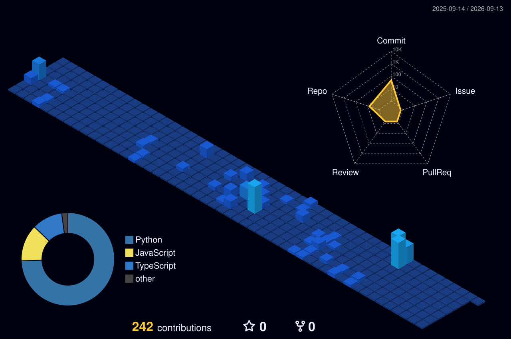

  

 

  <h3>✨ Advanced Generative Data Plot</h3>
  
  
<i>Daily generated 3D visual plotting created automatically by GitHub Actions running Python.</i>

---

  <h2>🚀 About Me</h2>
  
I am a developer focused on <b>Robotics (Turtlebots), Traffic Control Systems, and Deep Learning (TensorFlow)</b>. My goal is to build intelligent physical and virtual systems using elegant, mathematically sound foundations.

 

  <h2>📈 GitHub Metrics</h2>
  <table align="center" style="border: none;">
    <tr>
      <td align="center"></td>
      <td align="center"></td>
    </tr>
    <tr>
      <td colspan="2" align="center"></td>
    </tr>
  </table>

---

  <h2>🌐 3D Contribution Graph</h2>
  
  
<i>Automatically updated daily using GitHub Actions.</i>

 

  <h2>🐍 Contribution Snake Animation</h2>
  <picture>
    <source media="(prefers-color-scheme: dark)" srcset="https://raw.githubusercontent.com/flamekaizen/flamekaizen/output/dist/github-contribution-grid-snake-dark.svg">
    <source media="(prefers-color-scheme: light)" srcset="https://raw.githubusercontent.com/flamekaizen/flamekaizen/output/dist/github-contribution-grid-snake.svg">
    
  </picture>

