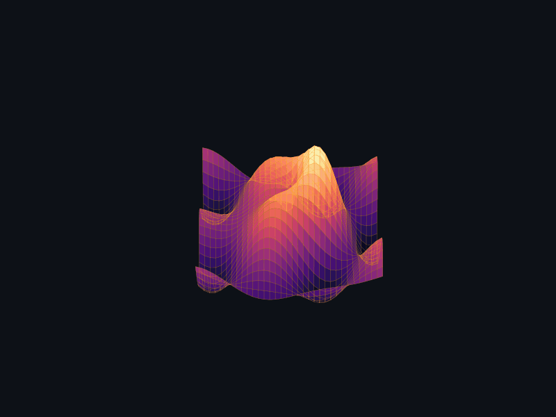
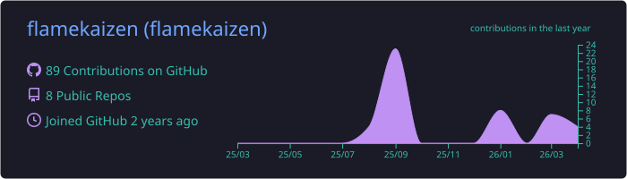
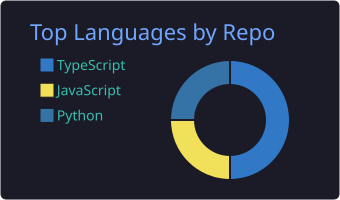
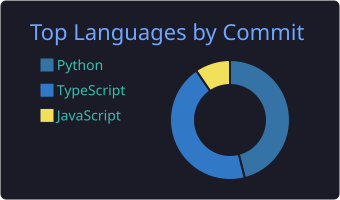
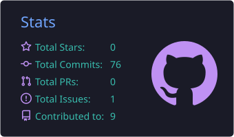
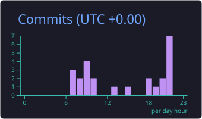
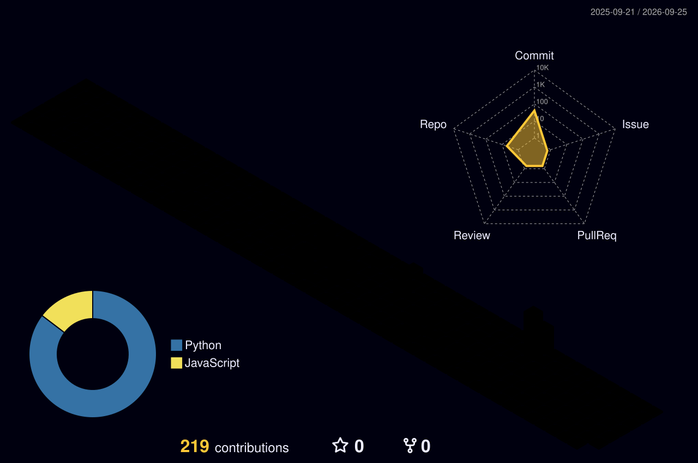

<!-- ═══════════════════════════════════════════════════════════════════════════
     🔥 FLAMEKAIZEN — HIGH-PERFORMANCE GITHUB PROFILE
     Theme: Dark Mode | Accent: #F73859 Flame Red | BG: #0D1117
     ═══════════════════════════════════════════════════════════════════════════ -->

<!-- CAPSULE RENDER HEADER -->

<!-- PROFILE VIEWS AND FOLLOWERS -->

  
  &nbsp;
  
  &nbsp;
  

<!-- TYPING SVG INTERACTIVE DESCRIPTION -->

 
 

### 🛠️ Core Technologies

  

<!-- ═══════════════════════════════════════════════════════════════════════════
     📋 COMPREHENSIVE METRICS DASHBOARD (self-hosted via lowlighter/metrics)
     Includes: stats, achievements, languages, calendar, habits, starred repos
     Generated by GitHub Actions — never breaks from API rate limits
     ═══════════════════════════════════════════════════════════════════════════ -->

### 📋 Comprehensive Metrics Dashboard

  <picture>
    
  </picture>

<!-- ═══════════════════════════════════════════════════════════════════════════
     🌌 GENERATIVE ART
     ═══════════════════════════════════════════════════════════════════════════ -->

### 🌌 3D Abstract Neural Network Architecture

<i>A rotating 3D loss surface procedurally animated in Python</i>

<!-- ═══════════════════════════════════════════════════════════════════════════
     📊 GITHUB PROFILE ANALYTICS — COMPREHENSIVE DASHBOARD
     ═══════════════════════════════════════════════════════════════════════════ -->

### 📊 GitHub Profile Analytics

<!-- ── TIER 1: Profile Overview (Full Width) ─────────────────────────────── -->

  

 

<!-- ── TIER 2: Language & Commit Distribution (2×2 Grid) ──────────────────── -->

  
  

  
  

 

<!-- ── TIER 3: Streak Stats (Full Width) ──────────────────────────────────── -->

  

 

<!-- ── TIER 4: Activity Graph (Full Width — High Readability) ─────────────── -->

  

 

<!-- ── TIER 5: 3D Isometric Contribution Map (Full Width) ─────────────────── -->

  

<!-- ═══════════════════════════════════════════════════════════════════════════
     🐍 CONTRIBUTION SNAKE
     ═══════════════════════════════════════════════════════════════════════════ -->

<h3 align="center">🐍 Continuous Contribution Snake</h3>
<picture>
  <source media="(prefers-color-scheme: dark)" srcset="https://raw.githubusercontent.com/flamekaizen/flamekaizen/output/github-contribution-grid-snake-dark.svg">
  <source media="(prefers-color-scheme: light)" srcset="https://raw.githubusercontent.com/flamekaizen/flamekaizen/output/github-contribution-grid-snake.svg">
  
</picture>

<!-- CAPSULE RENDER FOOTER -->

