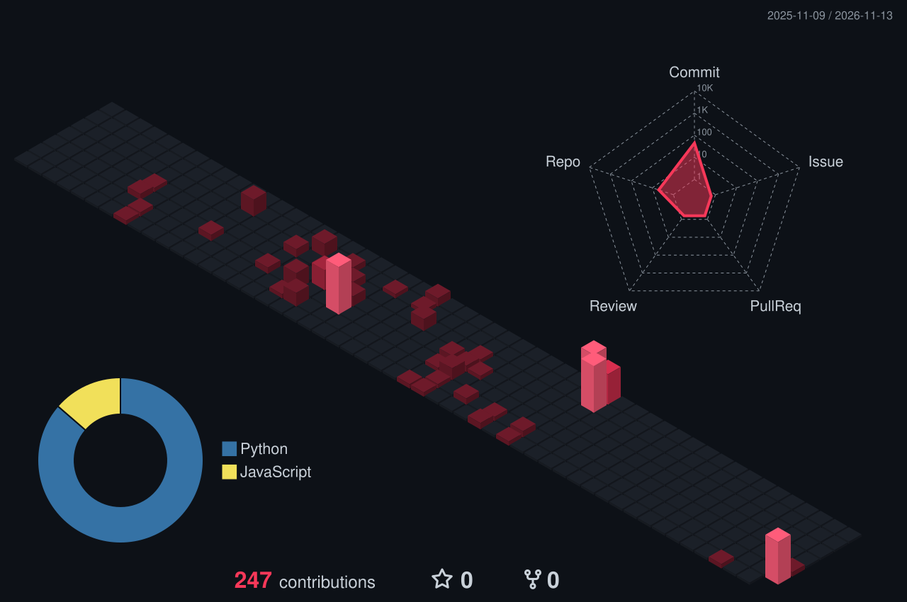
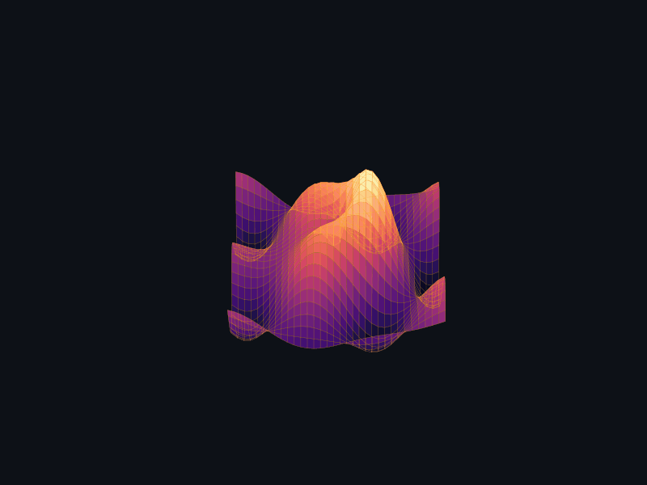

<div align="center">

<!-- ═══════════════════════════════════════════════════════════════════════════
     🔥 FLAMEKAIZEN — HIGH-PERFORMANCE GITHUB PROFILE
     Theme: Dark Mode | Accent: #F73859 Flame Red | BG: #0D1117
     Design rules: one question per panel · one meaning per colour
       red = activity · blue = models/derived · amber = annotation · green = growth
     ═══════════════════════════════════════════════════════════════════════════ -->

<!-- CAPSULE RENDER HEADER -->


<!-- TYPING SVG INTERACTIVE DESCRIPTION -->
<a href="https://github.com/flamekaizen">
  
</a>

<!-- STATUS STRIP -->
<p align="center">
  
  
  
  
</p>

<br/>

### 👨‍💻 About Me & Connect
<p align="center">
  🔭 I’m currently building next-generation <b>Machine Learning & Robotics</b> models.<br>
  🌱 I’m deeply focused on <b>Advanced Computer Vision algorithms</b>.<br>
  👯 I’m always open to collaborating on <b>Open Source AI initiatives</b>.<br>
  💬 Ask me about <b>PyTorch, ROS, and Neural Networks</b>.<br>
</p>
<p align="center">
  <a href="https://linkedin.com/in/flamekaizen"></a>
  <a href="https://x.com/flamekaizenx"></a>
  <a href="https://flamekaizen.vercel.app/"></a>
  <a href="mailto:kaizentechrk@gmail.com"></a>
</p>


<!-- ═══════════════════════════════════════════════════════════════════════════
     🧬 CAPABILITIES — what I work on, and with what
     ═══════════════════════════════════════════════════════════════════════════ -->

### 🧬 Research Vectors

<table>
  <tr>
    <th align="left">Vector</th>
    <th align="left">Focus</th>
    <th align="left">Toolchain</th>
  </tr>
  <tr>
    <td>👁️ <b>Computer Vision</b></td>
    <td>Detection, segmentation, representation learning</td>
    <td><code>PyTorch</code> <code>OpenCV</code> <code>scikit-learn</code></td>
  </tr>
  <tr>
    <td>🧠 <b>Deep Learning</b></td>
    <td>Sequence models, state-space models (Mamba), optimisation</td>
    <td><code>PyTorch</code> <code>TensorFlow</code> <code>Jupyter</code></td>
  </tr>
  <tr>
    <td>🤖 <b>Robotics & Autonomy</b></td>
    <td>Navigation, perception-to-control, manipulators</td>
    <td><code>ROS</code> <code>C++</code> <code>CMake</code></td>
  </tr>
  <tr>
    <td>📡 <b>Signals & Science</b></td>
    <td>Biomedical / acoustic signals, scientific computing</td>
    <td><code>NumPy</code> <code>SciPy</code> <code>MATLAB</code></td>
  </tr>
</table>

<br/>

### 🛠️ Tech Arsenal

| Layer | Stack |
|:--|:--|
| **Languages** |  |
| **ML & Vision** |  |
| **Robotics & Edge** |  |
| **Tooling & Web** |  |

<details>
<summary><b>⚙️ <code>profile.py</code> — me, as a data structure</b></summary>
<br/>

```python
from dataclasses import dataclass, field

@dataclass(frozen=True)
class Engineer:
    handle: str = "flamekaizen"
    role: str = "Machine Learning | Robotics Developer"
    timezone: str = "IST (UTC+5:30)"
    research: tuple = ("Computer Vision", "Deep Learning", "Robotics", "Signal Processing")
    languages: dict = field(default_factory=lambda: {
        "daily":      ["Python", "C++"],
        "frequently": ["TypeScript", "C", "MATLAB", "LaTeX"],
        "sometimes":  ["Java", "Rust", "Bash"],
    })
    frameworks: tuple = ("PyTorch", "TensorFlow", "scikit-learn", "OpenCV", "ROS")
    principle: str = "改善 — kaizen: continuous, compounding improvement"

    def objective(self) -> str:
        return "minimise(loss) while maximise(curiosity)"

me = Engineer()
```

</details>


<!-- ═══════════════════════════════════════════════════════════════════════════
     📡 MISSION CONTROL — SELF-HOSTED ANALYTICS
     Rendered by scripts/generate_analytics.py (GitHub Actions, every 6 h).
     Each panel answers exactly one question — no chart repeats another.
     ═══════════════════════════════════════════════════════════════════════════ -->

### 📡 Mission Control

<sub><code>HOW MUCH?</code> → <code>WHEN, OVER TIME?</code> → <code>WHEN, IN THE WEEK?</code> → <code>MADE OF WHAT?</code> → <code>WHAT CHARACTER?</code></sub>

<br/><br/>











<details>
<summary><b>🔬 Methodology — how these numbers are computed</b></summary>
<br/>

<div align="left">

| Metric | Definition |
|:--|:--|
| **7-day mean / 28-day EMA** | Simple moving average and exponential smoothing (α = 2/29) of daily contribution counts |
| **Trend slope** | Ordinary least-squares fit over the last 12 complete months, in contributions/month, with R² |
| **Duty cycle** | Share of the trailing 365 days with ≥ 1 contribution |
| **Fano factor F** | Variance-to-mean ratio `σ²/μ` — 1 for a Poisson process, ≫ 1 for clustered (sprint-style) work |
| **Gini index G** | Inequality of daily output — 0 = perfectly even, 1 = all work on a single day |
| **Burstiness B** | Goh–Barabási `(σ − μ)/(σ + μ)`: −1 periodic, 0 random, +1 extremely bursty |
| **ρ₁ autocorrelation** | Lag-1 autocorrelation — do active days cluster together? |
| **Weekday entropy H** | Shannon entropy of the weekday distribution normalised by log₂7 — 1 = perfectly uniform week |
| **Language spectrum** | Each repository carries equal weight, split by its byte fractions — one huge notebook can't drown out everything else |

**Colour grammar** — 🟥 flame red = raw activity · 🟦 blue = models & derived signals · 🟨 amber = annotations · 🟩 green = growth.
Data: GitHub GraphQL API, full history since account creation. Source: [`scripts/generate_analytics.py`](scripts/generate_analytics.py). Private repositories only feed aggregate numbers — no names are published.

</div>
</details>


<!-- ═══════════════════════════════════════════════════════════════════════════
     🧊 VISUAL LAB — the data as sculpture, the maths as art
     ═══════════════════════════════════════════════════════════════════════════ -->

### 🧊 Visual Lab


<p align="center"><sub><i>Contribution topology — the last year of work extruded into 3D</i></sub></p>

<br/>


<p align="center"><sub><i>Loss landscape &nbsp;<code>z = sin(r)·e<sup>−r/4</sup> + 0.4·cos(x)·sin(y)</code>&nbsp; — procedurally rendered in matplotlib</i></sub></p>

<br/>

<p align="center">
  <sub><code>⚡ self-updating · analytics every 6 h · topology & art daily · zero third-party chart servers</code></sub>
</p>

<!-- CAPSULE RENDER FOOTER -->


</div>
